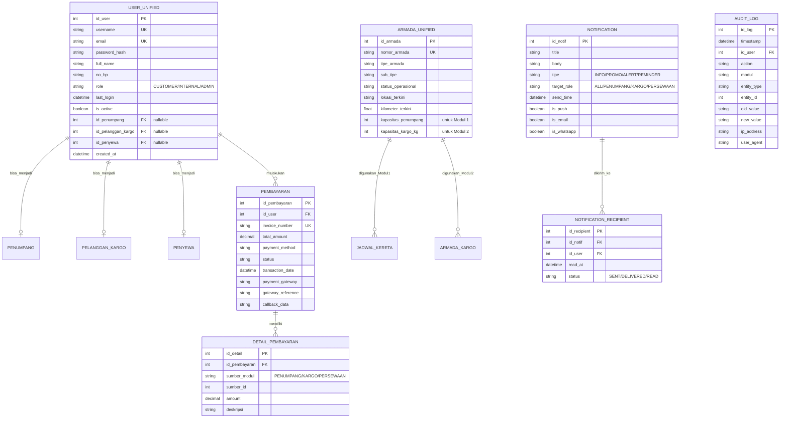

Saya akan buatkan **Entity Relationship Diagram (ERD)** untuk Landscape Arsitektur Utama platform KAI. ERD ini akan mencakup semua entitas utama dari 4 modul dan hubungan antar entitas.

---

# ENTITY RELATIONSHIP DIAGRAM (ERD)
## Landscape Arsitektur Utama - Platform KAI

---

## 1. ERD MASTER - SEMUA MODUL

---

## 2. ERD MODUL 1 - PENUMPANG (DETAIL)

---

## 3. ERD MODUL 2 - KARGO + WMS + TMS (DETAIL)

---

## 4. ERD MODUL 3 - PERSEWAAN ASET (DETAIL)

---

## 5. ERD MODUL 4 - ROLLINGSTOCK MANAGEMENT (DETAIL)

---

## 6. ERD INTEGRASI LINTAS MODUL

---

## 7. ERD MASTER - HUBUNGAN ANTAR MODUL

---

## 8. ENTITY SUMMARY - DAFTAR ENTITAS UTAMA

| Modul | Entitas | Deskripsi |
| :--- | :--- | :--- |
| **Semua** | USER_UNIFIED | Single identity untuk semua pengguna |
| **Semua** | PEMBAYARAN | Transaksi pembayaran terpusat |
| **Semua** | NOTIFICATION | Notifikasi lintas modul |
| **Semua** | AUDIT_LOG | Log audit untuk semua aktivitas |
| **Modul 1** | PENUMPANG | Data penumpang |
| **Modul 1** | PEMESANAN_TIKET | Pemesanan tiket |
| **Modul 1** | TIKET | Tiket kereta |
| **Modul 1** | JADWAL_KERETA | Jadwal perjalanan |
| **Modul 1** | RUTE | Rute perjalanan |
| **Modul 1** | STASIUN | Data stasiun |
| **Modul 1** | KOMPLAIN | Komplain pelanggan |
| **Modul 1** | LOYALTY_POIN | Poin loyalitas |
| **Modul 2** | PELANGGAN_KARGO | Pelanggan kargo |
| **Modul 2** | ORDER_KARGO | Order kargo |
| **Modul 2** | GUDANG | Data gudang |
| **Modul 2** | PRODUK | Master produk |
| **Modul 2** | INVENTORY_GUDANG | Stok di gudang |
| **Modul 2** | SHIPMENT | Pengiriman |
| **Modul 2** | ARMADA_KARGO | Armada kargo |
| **Modul 2** | TRACKING_HISTORY | Riwayat tracking |
| **Modul 3** | PENYEWA | Penyewa aset |
| **Modul 3** | ASET | Data aset |
| **Modul 3** | BOOKING_ASET | Booking aset |
| **Modul 3** | KONTRAK_SEWA | Kontrak sewa |
| **Modul 3** | TAGIHAN_SEWA | Tagihan sewa |
| **Modul 3** | SENSOR_ASET | Sensor IoT di aset |
| **Modul 4** | ARMADA | Data armada |
| **Modul 4** | TIPE_ARMADA | Tipe armada |
| **Modul 4** | PERAWATAN | Perawatan armada |
| **Modul 4** | SENSOR_ARMADA | Sensor di armada |
| **Modul 4** | SUKU_CADANG | Master suku cadang |
| **Modul 4** | TEKNISI | Data teknisi |
| **Modul 4** | PREDICTIVE_ALERT | Alert prediktif |

---

## 9. RELATIONSHIP CARDINALITY SUMMARY

| Relationship | Type | Deskripsi |
| :--- | :--- | :--- |
| PENUMPANG : PEMESANAN_TIKET | 1 : N | Satu penumpang bisa banyak pemesanan |
| PEMESANAN_TIKET : TIKET | 1 : N | Satu pemesanan bisa banyak tiket |
| JADWAL_KERETA : ARMADA_UNIFIED | N : 1 | Banyak jadwal bisa pakai satu armada |
| PELANGGAN_KARGO : ORDER_KARGO | 1 : N | Satu pelanggan banyak order |
| ORDER_KARGO : DETAIL_ORDER | 1 : N | Satu order banyak detail |
| ORDER_KARGO : SHIPMENT | 1 : 1 | Satu order jadi satu shipment |
| SHIPMENT : TRACKING_HISTORY | 1 : N | Satu shipment banyak tracking |
| GUDANG : INVENTORY | 1 : N | Satu gudang banyak inventory |
| ASET : KONTRAK_SEWA | 1 : N | Satu aset bisa banyak kontrak |
| PENYEWA : KONTRAK_SEWA | 1 : N | Satu penyewa banyak kontrak |
| ARMADA : PERAWATAN | 1 : N | Satu armada banyak perawatan |
| USER_UNIFIED : PEMBAYARAN | 1 : N | Satu user banyak pembayaran |
| PEMBAYARAN : DETAIL_PEMBAYARAN | 1 : N | Satu pembayaran bisa untuk banyak modul |

---

## 10. DATA WAREHOUSE - STAR SCHEMA

```mermaid
erDiagram
    %% FACT TABLES
    FACT_PENJUALAN_TIKET ||--o{ DIM_WAKTU : memiliki
    FACT_PENJUALAN_TIKET ||--o{ DIM_PENUMPANG : memiliki
    FACT_PENJUALAN_TIKET ||--o{ DIM_RUTE : memiliki
    FACT_PENJUALAN_TIKET ||--o{ DIM_LAYANAN : memiliki
    
    FACT_PENGIRIMAN_KARGO ||--o{ DIM_WAKTU : memiliki
    FACT_PENGIRIMAN_KARGO ||--o{ DIM_PELANGGAN_KARGO : memiliki
    FACT_PENGIRIMAN_KARGO ||--o{ DIM_RUTE : memiliki
    FACT_PENGIRIMAN_KARGO ||--o{ DIM_PRODUK : memiliki
    
    FACT_PERSEWAAN_ASET ||--o{ DIM_WAKTU : memiliki
    FACT_PERSEWAAN_ASET ||--o{ DIM_PENYEWA : memiliki
    FACT_PERSEWAAN_ASET ||--o{ DIM_ASET : memiliki
    
    FACT_PERAWATAN_ARMADA ||--o{ DIM_WAKTU : memiliki
    FACT_PERAWATAN_ARMADA ||--o{ DIM_ARMADA : memiliki
    FACT_PERAWATAN_ARMADA ||--o{ DIM_TEKNISI : memiliki
    
    %% DIMENSION TABLES
    DIM_WAKTU {
        int id_waktu PK
        date tanggal
        int tahun
        int bulan
        int minggu
        int hari
        string hari_nama
        string kuartal
        boolean is_weekend
        boolean is_holiday
    }
    
    DIM_PENUMPANG {
        int id_penumpang PK
        string nama
        string kota
        string provinsi
        int usia
        string gender
        int tier_loyalty
    }
    
    DIM_RUTE {
        int id_rute PK
        string kode_rute
        string stasiun_asal
        string stasiun_tujuan
        string kota_asal
        string kota_tujuan
        int jarak_km
    }
    
    DIM_PELANGGAN_KARGO {
        int id_pelanggan PK
        string nama_perusahaan
        string kota
        string provinsi
        string sektor_industri
        int total_order_ytd
    }
    
    DIM_ASET {
        int id_aset PK
        string kode_aset
        string nama_aset
        string kota
        string tipe_aset
        float luas_m2
        string status
    }
    
    DIM_ARMADA {
        int id_armada PK
        string nomor_armada
        string tipe_armada
        int tahun_pembuatan
        int umur_tahun
        float kilometer_terkini
    }
```

---

## 📋 CARA MENGGUNAKAN ERD

| Kegunaan | Diagram yang Digunakan |
| :--- | :--- |
| **Gambaran Umum** | ERD Master - Semua Modul (1) |
| **Detail per Modul** | ERD Modul 1-4 (2,3,4,5) |
| **Integrasi Antar Modul** | ERD Integrasi Lintas Modul (6) |
| **Relasi Lengkap** | ERD Master - Hubungan (7) |
| **Daftar Entitas** | Entity Summary (8) |
| **Business Intelligence** | Data Warehouse Star Schema (10) |

---

Semoga ERD ini membantu dalam menjelaskan struktur data platform KAI! Ada yang ingin ditambahkan atau disesuaikan?
