Saya akan buatkan **Enterprise Architecture Landscape dalam format Mermaid** yang bisa langsung Anda gunakan di presentasi (Markdown, Notion, atau tools yang support Mermaid).

---

# ENTERPRISE ARCHITECTURE LANDSCAPE - KAI PLATFORM
## Format Mermaid

---

## 1. STRATEGIC LAYER

```mermaid
graph TB
    subgraph STRATEGIC_LAYER[STRATEGIC LAYER]
        V[VISI PERUSAHAAN<br/>'Menjadi solusi mobilitas dan logistik terintegrasi<br/>berbasis rail yang unggul di Asia Tenggara']
        
        subgraph TUJUAN[TUJUAN STRATEGIS]
            T1[Peningkatan Pendapatan<br/>• Cross-selling<br/>• Utilisasi +20%]
            T2[Efisiensi Operasional<br/>• BBM -15%<br/>• Waktu tunggu -25%]
            T3[Optimasi Aset<br/>• Okupansi +25%<br/>• Utilisasi armada +20%]
            T4[Data-Driven Decision<br/>• Real-time dashboard<br/>• Predictive analytics]
        end
        
        V --> TUJUAN
    end
```

---

## 2. BUSINESS LAYER

---

## 3. APPLICATION LAYER

---

## 4. DATA LAYER

```mermaid
graph TB
    subgraph DATA_LAYER[DATA LAYER]
        subgraph SOURCES[SUMBER DATA - Data Sources]
            DB1[(Modul 1 DB<br/>PostgreSQL)]
            DB2[(Modul 2 DB<br/>PostgreSQL/TimescaleDB)]
            DB3[(Modul 3 DB<br/>PostgreSQL)]
            DB4[(Modul 4 DB<br/>InfluxDB/PostgreSQL)]
        end
        
        subgraph WAREHOUSE[DATA WAREHOUSE]
            DW[BigQuery<br/>• Data pelanggan terintegrasi<br/>• Data operasional historis<br/>• Data logistik & transportasi<br/>• Data perawatan sarana<br/>• Data aset & persewaan<br/>• Data IoT sensor]
        end
        
        subgraph VIRTUAL[DATA VIRTUALIZATION]
            DV[Dremio/Denodo<br/>• Menyatukan data berbagai sumber<br/>• API data untuk aplikasi & analitik]
        end
        
        subgraph EXTERNAL[SISTEM EKSTERNAL - Integrasi]
            EXT1[(CRM KAI 121<br/>Customer data)]
            EXT2[(SCM Divisi Logistik<br/>Supply chain)]
            EXT3[(HCM SAP/Raileo<br/>Pegawai data)]
            EXT4[(Sistem Vendor<br/>Outsourcing data)]
        end
        
        SOURCES --> WAREHOUSE
        EXTERNAL --> WAREHOUSE
        WAREHOUSE --> VIRTUAL
        
        DB1 <--> DW
        DB2 <--> DW
        DB3 <--> DW
        DB4 <--> DW
        EXT1 <--> DW
        EXT2 <--> DW
        EXT3 <--> DW
        EXT4 <--> DW
    end
```

---

## 5. TECHNOLOGY LAYER

---

## 6. INTEGRATION LAYER

---

## 7. SECURITY & GOVERNANCE LAYER

---

## 8. DEPLOYMENT & OPERATIONS LAYER

---

## 9. COMPLETE ENTERPRISE ARCHITECTURE LANDSCAPE

---

## 10. RINGKASAN LANDSCAPE (TABEL)

---

## 📋 CARA MENGGUNAKAN

1. **Salin kode Mermaid** ke dalam file dengan ekstensi `.mmd` atau langsung ke platform yang mendukung Mermaid:
   - GitHub Markdown
   - Notion (dengan plugin Mermaid)
   - Obsidian
   - Mermaid Live Editor (https://mermaid.live)
   - Presentasi tools yang support Mermaid

2. **Untuk presentasi**, Anda bisa mengekspor setiap diagram sebagai PNG/SVG dari Mermaid Live Editor

3. **Urutan presentasi** yang disarankan:
   - Slide 1: Strategic Layer (visi & tujuan)
   - Slide 2: Business Layer (3 pilar bisnis)
   - Slide 3: Application Layer (modul & aplikasi)
   - Slide 4: Data Layer (sumber data)
   - Slide 5: Technology Layer (infrastruktur)
   - Slide 6: Integration Layer (hubungan antar sistem)
   - Slide 7: Security Layer (keamanan)
   - Slide 8: Operations Layer (deployment)
   - Slide 9: Complete Landscape (gabungan)
   - Slide 10: Ringkasan

---

Semoga diagram Mermaid ini membantu presentasi Anda! Ada yang ingin disesuaikan atau ditambahkan?
