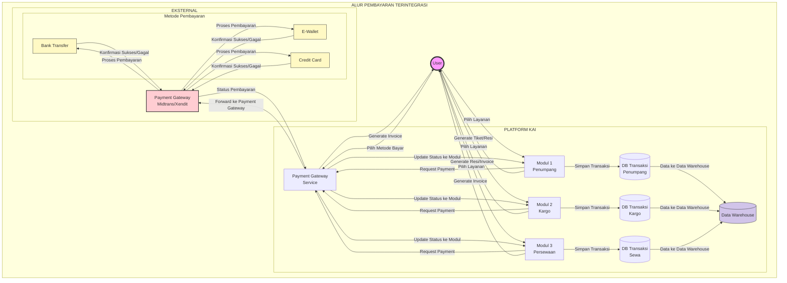
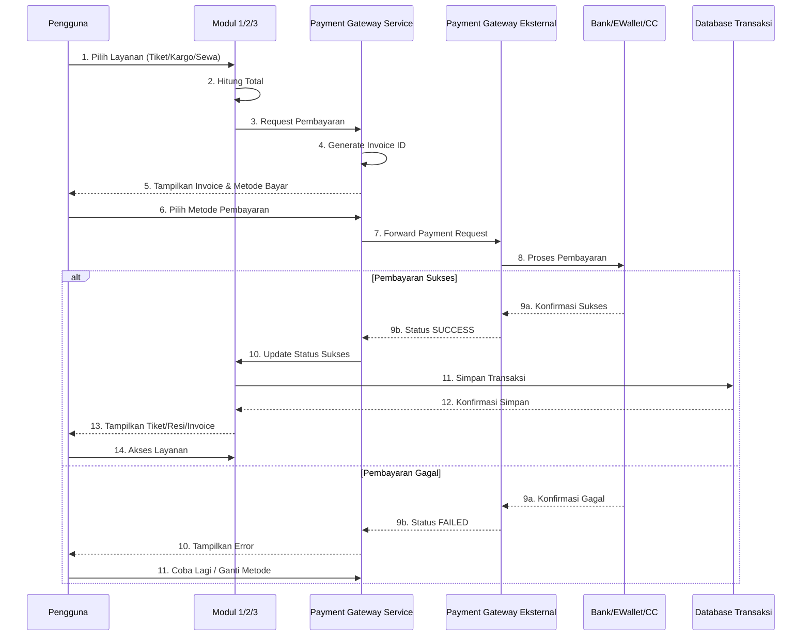
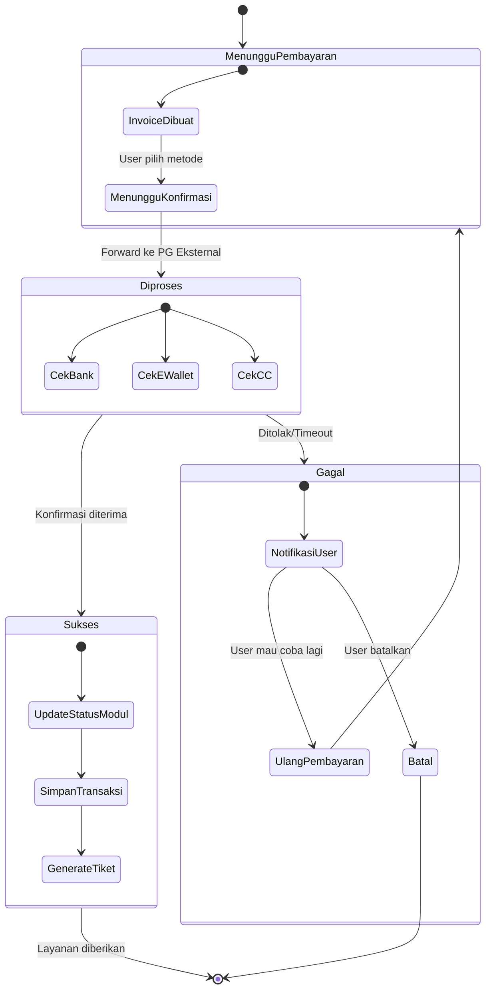
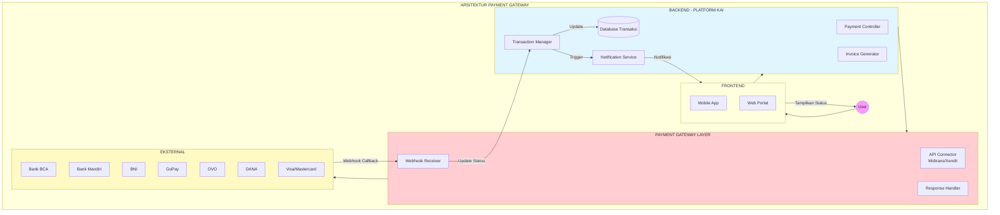
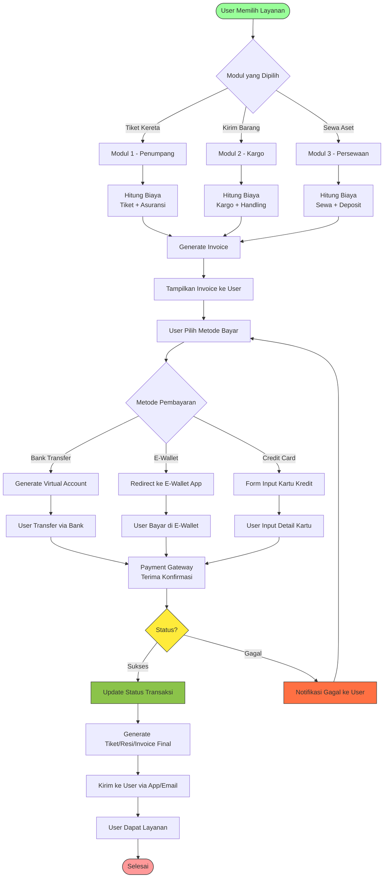
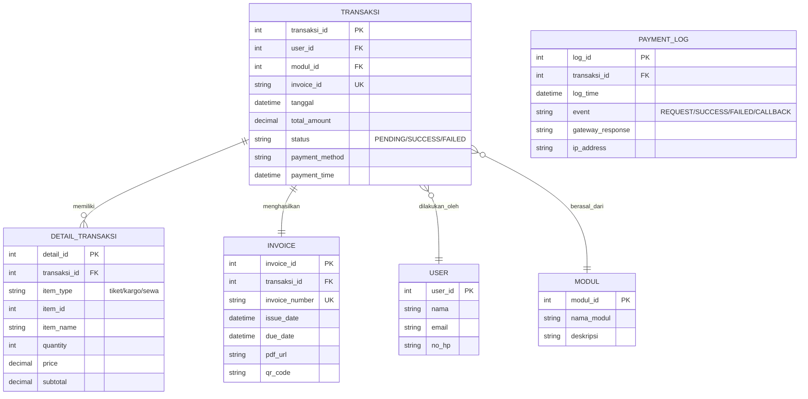
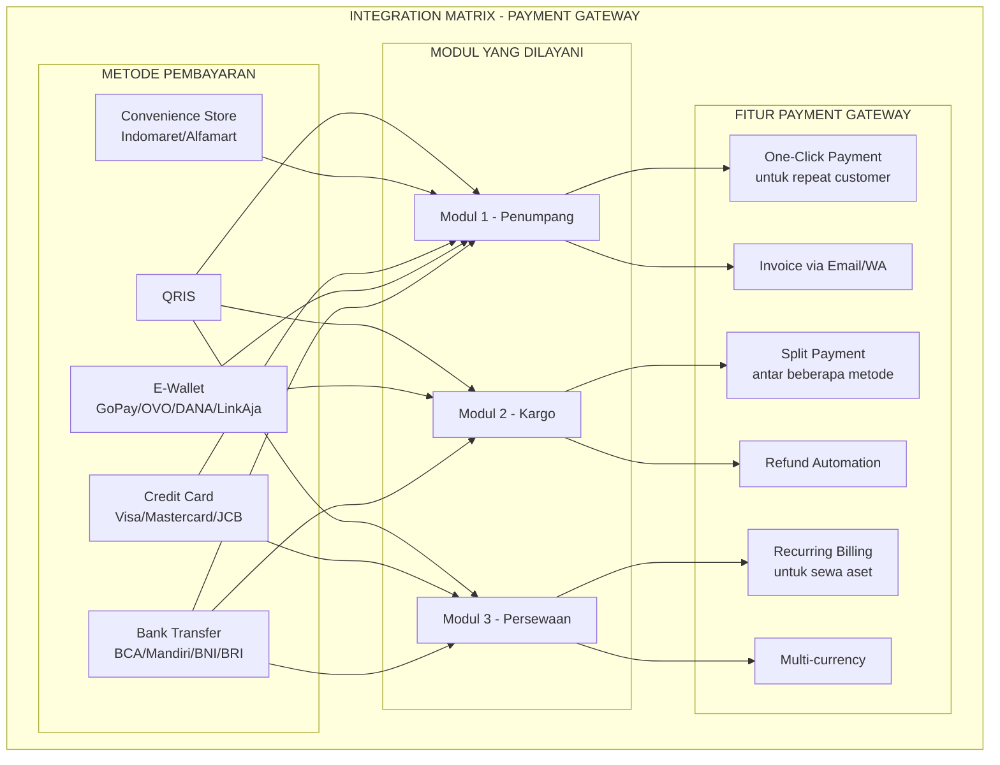
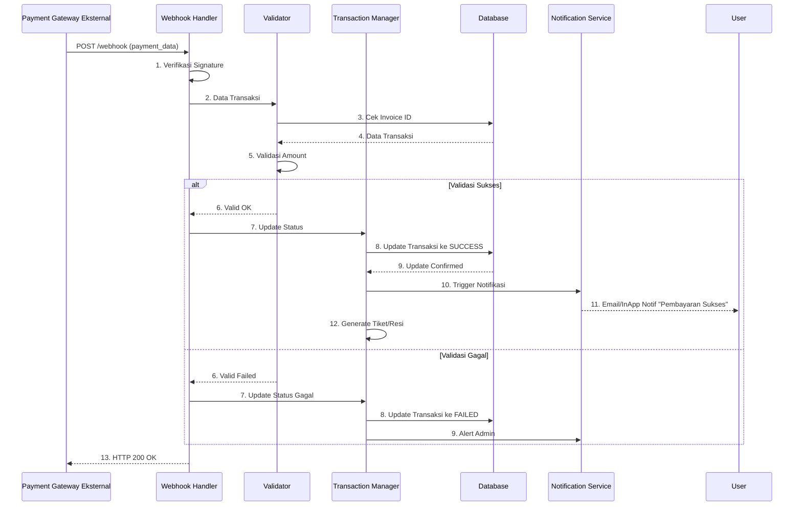

Saya akan perbaiki **DFD Alur Pembayaran Terintegrasi** dengan format Mermaid yang benar. Error sebelumnya kemungkinan karena sintaks yang kurang tepat.

---

# DFD - ALUR PEMBAYARAN TERINTEGRASI (FIXED)
## Format Mermaid yang Benar

---

## 1. DFD LEVEL 2 - ALUR PEMBAYARAN (FLOWCHART STYLE)

---

## 2. ALUR PEMBAYARAN - SEQUENCE DIAGRAM

---

## 3. ALUR PEMBAYARAN - STATE DIAGRAM

---

## 4. ALUR PEMBAYARAN - DATA FLOW DETAIL

```mermaid
flowchart LR
    subgraph INPUT[INPUT DATA]
        A1[Data Order<br/>dari Modul]
        A2[Data User<br/>ID Pelanggan]
        A3[Metode Pembayaran<br/>yang Dipilih]
    end
    
    subgraph PROCESS[PROSES]
        B1[Generate Invoice<br/>ID Unik]
        B2[Hitung Total<br/>+ Biaya Admin]
        B3[Validasi Metode<br/>Pembayaran]
        B4[Komunikasi dengan<br/>PG Eksternal]
        B5[Update Status<br/>Transaksi]
    end
    
    subgraph OUTPUT[OUTPUT DATA]
        C1[Invoice & QR Code]
        C2[Status Transaksi<br/>Sukses/Gagal]
        C3[Tiket/Resi Digital]
        C4[Data Transaksi<br/>ke Database]
    end
    
    subgraph STORAGE[PENYIMPANAN]
        D1[(DB Transaksi<br/>Penumpang)]
        D2[(DB Transaksi<br/>Kargo)]
        D3[(DB Transaksi<br/>Sewa)]
        D4[(Data Warehouse<br/>BigQuery)]
    end
    
    INPUT --> PROCESS
    PROCESS --> OUTPUT
    OUTPUT --> STORAGE
    
    D1 --> D4
    D2 --> D4
    D3 --> D4
    
    style INPUT fill:#e1f5fe
    style PROCESS fill:#fff3e0
    style OUTPUT fill:#e8f5e8
    style STORAGE fill:#f3e5f5
```

---

## 5. INTEGRASI PAYMENT GATEWAY - ARSITEKTUR

---

## 6. FLOW PEMBAYARAN LINTAS MODUL

---

## 7. DATA ENTITY - TRANSAKSI PEMBAYARAN

---

## 8. PAYMENT GATEWAY - INTEGRATION MATRIX

---

## 9. SEQUENCE - PAYMENT CALLBACK HANDLER

---

## 10. PAYMENT DASHBOARD - MONITORING

```mermaid
graph TB
    subgraph DASHBOARD[PAYMENT DASHBOARD - MONITORING REAL-TIME]
        
        subgraph METRICS[METRIK UTAMA]
            M1[Total Transaksi<br/>Hari Ini: Rp X]
            M2[Transaksi Sukses<br/>Hari Ini: X transaksi]
            M3[Transaksi Gagal<br/>Hari Ini: X transaksi]
            M4[Pending Payment<br/>X transaksi]
            M5[Total Revenue<br/>Bulan Ini: Rp X]
        end
        
        subgraph CHART[GRAFIK]
            C1[Grafik Transaksi per Jam]
            C2[Grafik Revenue per Modul]
            C3[Metode Pembayaran Favorit]
        end
        
        subgraph RECENT[TRANSAKSI TERKINI]
            R1[ID: INV001 - Sukses - 10:30]
            R2[ID: INV002 - Pending - 10:25]
            R3[ID: INV003 - Sukses - 10:20]
            R4[ID: INV004 - Failed - 10:15]
        end
        
        subgraph ALERT[ALERT & NOTIFIKASI]
            A1[⚠️ 3 transaksi gagal beruntun]
            A2[⚠️ Payment gateway lambat >5 detik]
        end
        
        METRICS --> CHART
        CHART --> RECENT
        RECENT --> ALERT
        
    end
    
    style METRICS fill:#e1f5fe
    style CHART fill:#fff3e0
    style RECENT fill:#e8f5e8
    style ALERT fill:#ffcdd2
```

---

## 🎯 FITUR-FITUR PAYMENT SYSTEM

| Fitur | Deskripsi | Modul |
| :--- | :--- | :--- |
| **One-Click Payment** | Simpan metode pembayaran untuk transaksi berikutnya | Penumpang |
| **Split Payment** | Bayar dengan 2 metode (contoh: GoPay + CC) | Kargo |
| **Recurring Billing** | Tagihan otomatis bulanan untuk sewa aset | Persewaan |
| **Refund Automation** | Refund otomatis ke sumber pembayaran awal | Semua Modul |
| **Invoice Digital** | Generate dan kirim invoice via email/WA | Semua Modul |
| **QRIS** | Bayar dengan scan QR code | Semua Modul |
| **Multi-currency** | Support mata uang asing untuk pelanggan internasional | Kargo |

---

Semoga diagram yang sudah diperbaiki ini bisa tampil dengan baik! Ada yang ingin ditambahkan?
